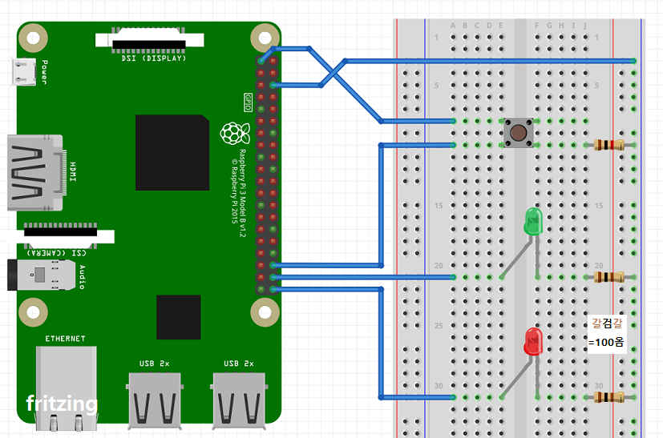
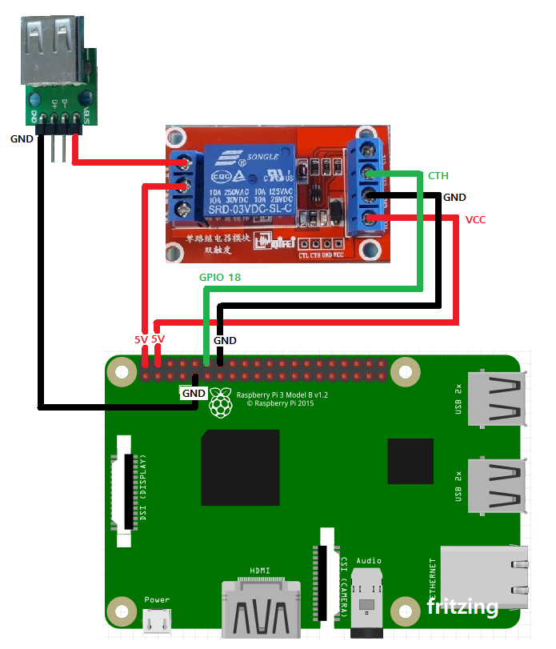
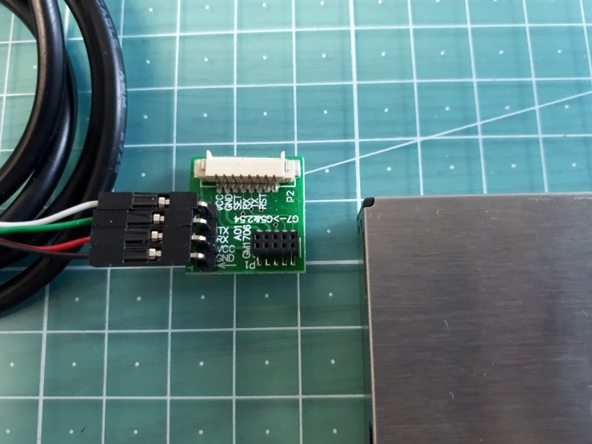
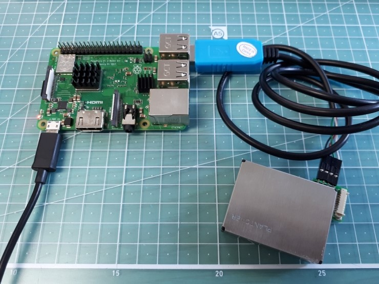

# 라즈베리파이 Blynk 예제 Hardware 가이드 이미지
  
**라즈베리파이 iot kit**에서 사용되는 부품들의 연결 방법 이미지 입니다.  
  
## GPIO 연결 - LED 및 스위치  
  
  
  
## GPIO 연결 - 릴레이보드  
  
  
  
## PMS7003 먼지센서 연결  
  
인터페이스 보드 연결  
  
  
USB to UART 케이블로 USB 연결  
  
  